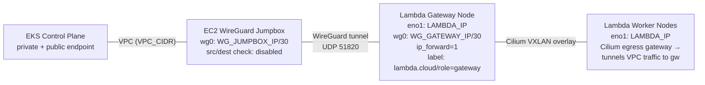

# EKS Hybrid Nodes with Lambda Cloud

This document describes how the Lambda Karpenter provider integrates with Amazon EKS Hybrid Nodes to dynamically provision Lambda Cloud GPU instances as Kubernetes worker nodes.

## Architecture Overview



Two node types in Lambda Cloud:

- **Gateway nodes**: Hold the WireGuard tunnel to the AWS jumpbox, have IP forwarding enabled, labeled `lambda.cloud/role=gateway`. Set up manually via `lambdactl launch` — not managed by Karpenter. All Lambda nodes (gateway and worker) are GPU instances and participate in the cluster.
- **Worker nodes**: No WireGuard. Pod traffic to the VPC is routed through gateway nodes by Cilium's egress gateway (VXLAN overlay). A host-level static route is added during bootstrap for nodeadm to reach the EKS API before Cilium starts. Provisioned by the Karpenter provider.

The Karpenter provider runs inside the EKS cluster and:
1. Creates a per-node SSM activation via the AWS API (using IRSA/Pod Identity)
2. Launches a Lambda Cloud instance with cloud-init containing the SSM credentials
3. The instance boots, installs nodeadm, and joins the EKS cluster
4. Cilium starts, and the egress gateway policy routes pod VPC traffic through the gateway's WireGuard tunnel
5. Karpenter matches the node by provider ID (`lambda://<instance-id>`)

## Prerequisites

### AWS IAM Roles

**EKS Cluster Role** (`EKSClusterRole`):
- Trust: `eks.amazonaws.com`
- Policy: `AmazonEKSClusterPolicy`

**Hybrid Nodes Role** (`AmazonEKSHybridNodesRole`):
- Trust: `ssm.amazonaws.com` (scoped to account + region)
- Policies:
  - `AmazonSSMManagedInstanceCore`
  - `AmazonEC2ContainerRegistryReadOnly`
  - Custom policy with `eks:DescribeCluster`, `eks:ListAccessEntries`, ECR pull permissions, and `ssm:DeregisterManagedInstance`

**Karpenter Provider Role** (for IRSA/Pod Identity on the provider's ServiceAccount):
- Trust: EKS OIDC provider (IRSA) or Pod Identity
- Policy:
  ```json
  {
    "Statement": [
      {
        "Effect": "Allow",
        "Action": ["ssm:CreateActivation", "ssm:DeleteActivation"],
        "Resource": "*"
      },
      {
        "Effect": "Allow",
        "Action": "iam:PassRole",
        "Resource": "arn:aws:iam::ACCOUNT:role/AmazonEKSHybridNodesRole"
      }
    ]
  }
  ```

### EKS Cluster Configuration

Create the cluster with hybrid node support:
```bash
aws eks create-cluster \
  --name CLUSTER_NAME \
  --role-arn arn:aws:iam::ACCOUNT:role/EKSClusterRole \
  --kubernetes-version 1.31 \
  --resources-vpc-config "subnetIds=SUBNET_IDS,endpointPublicAccess=true,endpointPrivateAccess=true" \
  --remote-network-config '{
    "remoteNodeNetworks": [{"cidrs": ["LAMBDA_NODE_CIDR"]}],
    "remotePodNetworks": [{"cidrs": ["POD_CIDR"]}]
  }' \
  --access-config authenticationMode=API
```

Create the hybrid node access entry:
```bash
aws eks create-access-entry \
  --cluster-name CLUSTER_NAME \
  --principal-arn arn:aws:iam::ACCOUNT:role/AmazonEKSHybridNodesRole \
  --type HYBRID_LINUX
```

This maps the hybrid nodes role to `system:node:{{SessionName}}` username with `system:bootstrappers` and `system:nodes` group membership.

### VPC Network Routes

The VPC route table needs routes for Lambda traffic through the Wireguard jumpbox:

| Destination      | Target             | Purpose                                  |
|------------------|--------------------|------------------------------------------|
| LAMBDA_NODE_CIDR | Wireguard instance | Node traffic (172.26.0.0/16)             |
| POD_CIDR         | Wireguard instance | Pod traffic (10.20.0.0/16)               |
| WG_TUNNEL_CIDR   | Wireguard instance | Egress gateway SNAT source (10.100.0.0/30) |

The Wireguard EC2 instance must have **source/dest check disabled**.

### Wireguard Setup

Both sides assign an `Address` on the WG interface. The Cilium egress gateway SNATs pod traffic to the gateway's wg0 IP (e.g. `10.100.0.2`), so the tunnel link needs its own routable subnet.

**EC2 Jumpbox** (`/etc/wireguard/wg0.conf`):
```ini
[Interface]
Address = 10.100.0.1/30
PrivateKey = <server-private-key>
ListenPort = 51820
MTU = 1420

[Peer]
# Lambda gateway
PublicKey = <gateway-public-key>
AllowedIPs = LAMBDA_NODE_CIDR, POD_CIDR, WG_TUNNEL_CIDR
```

**Lambda Gateway** (`/etc/wireguard/wg0.conf`):
```ini
[Interface]
Address = 10.100.0.2/30
PrivateKey = <gateway-private-key>
MTU = 1420

[Peer]
PublicKey = <jumpbox-public-key>
Endpoint = <jumpbox-public-ip>:51820
AllowedIPs = VPC_CIDR
PersistentKeepalive = 25
```

**Key notes**:
- The jumpbox's `AllowedIPs` must include `WG_TUNNEL_CIDR` (e.g. `10.100.0.0/30`) so reply traffic to the egress-gateway-SNATed source IP is routed back through the tunnel.
- The gateway does **not** need `WG_TUNNEL_CIDR` in `AllowedIPs` — it only sends VPC-bound traffic through the tunnel.
- **No masquerade on either side.** The only SNAT is Cilium's egress gateway (pod IP → wg0 IP). The VPC route table routes replies for `WG_TUNNEL_CIDR` back to the jumpbox, and WireGuard `AllowedIPs` routes them back through the tunnel to the gateway. No `PostUp` iptables/nftables rules needed.

**MTU**: Must be 1420 (internet path MTU 1500 minus ~80 bytes WG overhead). wg-quick auto-detects from the underlying interface, which gives ~8920 on EC2 jumbo-frame instances — far too large for the internet-facing tunnel. Without the explicit MTU, large packets (e.g. TLS ServerHello) are silently dropped.

IP forwarding must be enabled on both the jumpbox and the gateway:
```bash
sysctl -w net.ipv4.ip_forward=1
echo 'net.ipv4.ip_forward=1' > /etc/sysctl.d/99-forward.conf
```

### Security Groups

**Wireguard Jumpbox SG** (inbound):

| Protocol | Port  | Source    | Purpose   |
|----------|-------|----------|-----------|
| TCP      | 22    | 0.0.0.0/0 | SSH       |
| UDP      | 51820 | 0.0.0.0/0 | Wireguard |

Outbound: all traffic (default). Forwarded VPC traffic (EKS → Lambda node) traverses the jumpbox ENI and is allowed by SG stateful tracking on the outbound leg.

**EKS Cluster SG** (additional inbound rules):

| Protocol | Port | Source           | Purpose                                         |
|----------|------|------------------|-------------------------------------------------|
| TCP      | 443  | Jumpbox SG       | API server access (from jumpbox)                |
| TCP      | 443  | LAMBDA_NODE_CIDR | API server access (nodes)                       |
| TCP      | 443  | POD_CIDR         | API server access (pods)                        |
| TCP      | 443  | WG_TUNNEL_CIDR   | API server access (egress gateway SNAT source)  |

The cluster SG is auto-created by EKS with self-referencing rules and outbound allow-all. The additional rules above must be added manually for hybrid node connectivity.

### Cilium CNI

Cilium is required for pod networking on hybrid nodes. It must run in **tunnel mode** with **kube-proxy replacement** and **egress gateway** enabled.

```bash
helm install cilium cilium/cilium -n kube-system -f cilium-values.yaml
```

See `examples/eks-hybrid/cilium-values.yaml` for the full values file.

**Why tunnel mode**: Lambda Cloud enforces strict source+destination IP filtering (anti-spoofing) at the SDN level. Only packets where both source and destination IPs are Lambda instance IPs can transit the physical network. VXLAN tunnel mode encapsulates pod and VPC traffic inside Lambda-to-Lambda outer UDP headers, satisfying this constraint. Native routing mode would send packets with pod or VPC IPs on the wire, which the SDN silently drops.

**Why egress gateway**: Pods need to reach the AWS VPC (e.g. the EKS API server at its private IP). The egress gateway intercepts pod traffic destined for the VPC CIDR, tunnels it through the Cilium VXLAN overlay to a designated gateway node, and SNATs the source IP to the gateway's wg0 interface IP. The gateway then forwards the traffic through its WireGuard tunnel to the AWS jumpbox.

**Critical settings**:
- **`kubeProxyReplacement: true`**: Required by egress gateway. Replaces kube-proxy with Cilium's BPF implementation.
- **`egressGateway.enabled: true`**: Enables the egress gateway feature and BPF datapath hooks.
- **`routingMode: tunnel`** + **`tunnelProtocol: vxlan`**: Pod-to-pod traffic encapsulated in VXLAN. Required due to Lambda Cloud's IP filtering.
- **`k8sServiceHost`/`k8sServicePort`**: Must be the EKS API endpoint FQDN (not the ClusterIP). Cilium needs to reach the API server to bootstrap before KPR service rules are installed.
- **`bpf.masquerade: true`**: BPF-based masquerade for non-pod-CIDR destinations. VPC-bound traffic is handled by the egress gateway SNAT, not by masquerade.

### Cilium Egress Gateway Policy

After Cilium is installed, apply a `CiliumEgressGatewayPolicy` to route VPC-bound pod traffic through gateway nodes:

```bash
kubectl apply -f egress-gateway-policy.yaml
```

See `examples/eks-hybrid/egress-gateway-policy.yaml` for the full manifest.

The policy selects all pods, matches traffic to the VPC CIDR (`172.31.0.0/16`), and routes it through nodes labeled `lambda.cloud/role=gateway` via their `wg0` interface. Cilium SNATs the pod source IP to the gateway's wg0 IP (e.g. `10.100.0.2`).

**Traffic flow** (pod on worker → EKS API server):
1. Pod sends to VPC private IP (e.g. `172.31.18.204:443`)
2. Worker Cilium BPF matches egress gateway policy → VXLAN-tunnels to gateway node
3. Gateway Cilium BPF de-tunnels, SNATs source to wg0 IP (`10.100.0.2`) → kernel routes via wg0
4. WireGuard delivers to jumpbox → jumpbox forwards into VPC (no masquerade, src=`10.100.0.2`)
5. Reply to `10.100.0.2` → VPC route → jumpbox → WireGuard → gateway → Cilium de-SNATs → VXLAN → pod

**Multiple gateways**: Use the `egressGateways` (plural) list field to distribute pods across multiple gateway nodes. Cilium uses FNV-1a hash-based assignment (hash of endpoint UID mod gateway count). See the example manifest for details. Note: this provides load distribution but not automatic failover — if a gateway goes down without being removed from the cluster, traffic directed to it is dropped (Cilium issue #18230).

## Node Bootstrap Flow

### What the provider does at launch time (worker nodes)

1. Calls `ssm:CreateActivation` with `registrationLimit=1`, short expiry, and `iamRole=AmazonEKSHybridNodesRole`
2. Receives `activationCode` and `activationId`
3. Renders cloud-init template with the activation credentials and gateway IP
4. Calls Lambda API `LaunchInstance` with the rendered cloud-init as `userData`

### Gateway cloud-init (full bootstrap)

Gateway nodes are launched manually via `lambdactl launch`. From a fresh Ubuntu 24.04 Lambda Stack image:

```bash
# 1. Remove conflicting Lambda Stack services and packages.
#    Docker wraps containerd with its own config and creates a docker0 bridge
#    (172.17.0.1/16) that can interfere with pod/node routing.
#    containerd.io is kept — nodeadm manages it directly.
systemctl disable --now \
  lambda-jupyter.service \
  cloudflared.service cloudflared-update.service cloudflared-update.timer \
  docker.service docker.socket \
  glances.service \
  postfix@-.service
ip link delete docker0 2>/dev/null || true
apt-get purge -y -qq \
  docker-ce docker-ce-cli docker-buildx-plugin \
  docker-compose-plugin docker-ce-rootless-extras \
  cloudflared glances podman

# 2. Enable IP forwarding (for worker node traffic)
sysctl -w net.ipv4.ip_forward=1
echo 'net.ipv4.ip_forward=1' > /etc/sysctl.d/99-forward.conf

# 3. Install WireGuard and establish tunnel
apt-get update -qq && apt-get install -y -qq wireguard-tools
# Write wg0.conf with Address (required for egress gateway SNAT), start wg-quick@wg0

# 4. Download and install nodeadm (not pre-installed on Lambda Stack)
curl -fsSL "https://hybrid-assets.eks.amazonaws.com/releases/latest/bin/linux/amd64/nodeadm" \
  -o /usr/local/bin/nodeadm
chmod +x /usr/local/bin/nodeadm
nodeadm install 1.31 --credential-provider ssm

# 5. Resolve instance ID for provider-id
INSTANCE_ID="$(cat /var/lib/cloud/data/instance-id | tr -d '\n-')"

# 6. Write nodeadm config
cat > /etc/eks/nodeadm-config.yaml <<EOF
apiVersion: node.eks.aws/v1alpha1
kind: NodeConfig
spec:
  cluster:
    name: <eks-cluster-name>
    region: <aws-region>
  hybrid:
    ssm:
      activationCode: <activation-code>
      activationId: <activation-id>
  kubelet:
    flags:
      - --provider-id=lambda://${INSTANCE_ID}
      - --node-labels=lambda.cloud/role=gateway
EOF

# 7. Join the cluster
nodeadm init --config-source file:///etc/eks/nodeadm-config.yaml
```

### Worker cloud-init (no WireGuard)

Worker nodes are launched by the Karpenter provider. Same as gateway except: no WireGuard, no IP forwarding. A host-level static route through the gateway is added for nodeadm bootstrap (before Cilium starts). Once the node joins and Cilium is running, pod traffic to the VPC uses the egress gateway.

```bash
# 1. Remove conflicting Lambda Stack services and packages (same as gateway)

# 2. Add static route to VPC through gateway (for nodeadm bootstrap only)
ip route add VPC_CIDR via GATEWAY_IP

# 3. Download and install nodeadm
curl -fsSL "https://hybrid-assets.eks.amazonaws.com/releases/latest/bin/linux/amd64/nodeadm" \
  -o /usr/local/bin/nodeadm
chmod +x /usr/local/bin/nodeadm
nodeadm install 1.31 --credential-provider ssm

# 4. Resolve instance ID, write nodeadm config (no gateway label), join cluster
```

See `examples/eks-hybrid/gateway-cloud-init.sh` and `examples/eks-hybrid/worker-cloud-init.sh` for complete tested scripts.

### How the provider matches nodes to instances

1. Lambda API returns `instance.ID` on launch (e.g., `0de256c4a9a34ad5b6f49142b0970612`)
2. Provider sets `NodeClaim.Status.ProviderID = "lambda://0de256c4a9a34ad5b6f49142b0970612"`
3. Cloud-init reads the same ID from `/var/lib/cloud/data/instance-id`, strips dashes
4. Kubelet starts with `--provider-id=lambda://0de256c4a9a34ad5b6f49142b0970612`
5. Karpenter core matches the node to the NodeClaim by provider ID

Tag-based idempotency: instances are tagged with `karpenter-sh-nodeclaim=<name>` so the provider can find existing instances if Create() is retried.

## Dynamic SSM Activation Design

Instead of a static SSM activation (which has registration limits and expiry), the provider creates per-node activations on demand:

- **No stored credentials**: The provider's ServiceAccount is mapped to an IAM role (via IRSA) that can call `ssm:CreateActivation` and `iam:PassRole`
- **Single-use**: Each activation has `registrationLimit=1` and a short expiry (~1 hour)
- **Cleanup on delete**: `Provider.Delete()` calls `ssm:DeleteActivation` after terminating the instance
- **No rotation needed**: Activations are ephemeral, created fresh for each node

### Provider code changes needed

1. **`internal/provider/provider.go`**: In `Create()`, call `ssm:CreateActivation` before building the launch request. Pass activation code/ID as new template variables.
2. **`internal/provider/userdata.go`**: Add `SSMActivationCode`, `SSMActivationID`, and `GatewayIP` to `userDataContext`. `GatewayIP` is needed for the worker's host-level bootstrap static route.
3. **`internal/provider/provider.go`**: In `Delete()`, call `ssm:DeleteActivation` for cleanup.
4. **Helm chart `_userdata.tpl`**: Rewrite eks-hybrid template for workers: service cleanup, static route to gateway (for bootstrap), nodeadm download + install + init. No WireGuard.
5. **Helm chart `values.yaml`**: Remove static `eksSSMActivationCode`/`eksSSMActivationID` values (no longer needed). Add `cluster.eksGatewayIP` for the gateway node's Lambda VPC IP.

## Test Environment Reference

| Resource | Value |
|----------|-------|
| AWS Account | ACCOUNT_ID |
| Region | us-west-2 |
| EKS Cluster | CLUSTER_NAME |
| K8s Version | 1.31 |
| VPC | VPC_ID (VPC_CIDR) |
| EKS Endpoint | https://EKS_ENDPOINT.gr7.REGION.eks.amazonaws.com |
| Service CIDR | 10.0.0.0/16 |
| Remote Node Network | 172.26.0.0/16 |
| Remote Pod Network | 10.20.0.0/16 |
| Wireguard Jumpbox | EC2 instance (JUMPBOX_PUBLIC_IP / JUMPBOX_VPC_IP) |
| Lambda Gateway | Lambda instance (GATEWAY_PUBLIC_IP / GATEWAY_LAMBDA_IP) |
| Hybrid Nodes Role | arn:aws:iam::ACCOUNT_ID:role/AmazonEKSHybridNodesRole |
| Cilium | 1.19.1 (tunnel/vxlan, KPR, egress gateway) |
